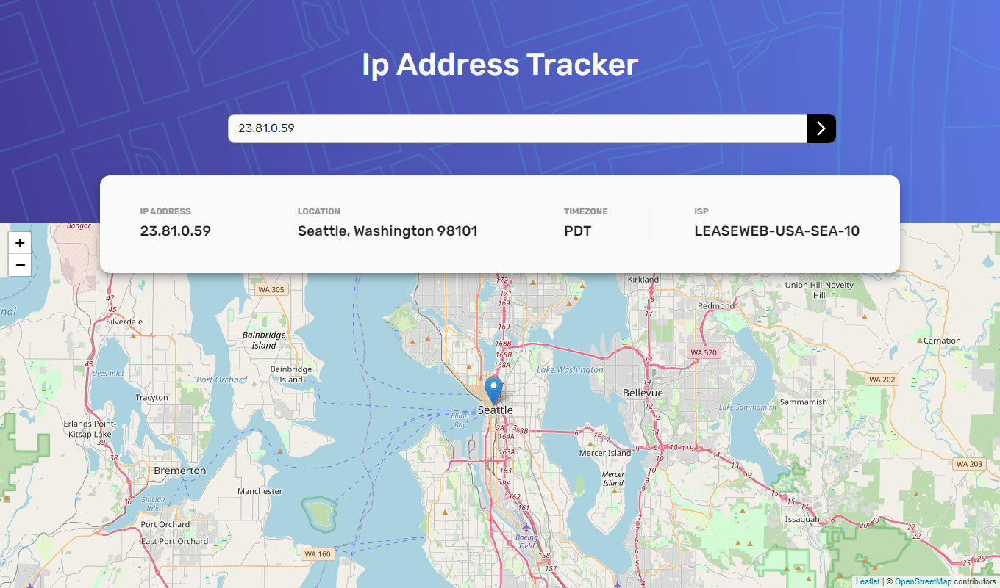
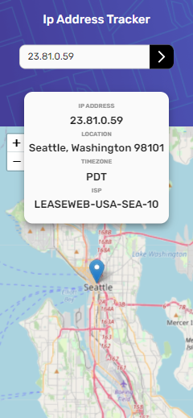

# Frontend Mentor - IP address tracker solution

This is a solution to the [IP address tracker challenge on Frontend Mentor](https://www.frontendmentor.io/challenges/ip-address-tracker-I8-0yYAH0). Frontend Mentor challenges help you improve your coding skills by building realistic projects. 

## Table of contents

- [Overview](#overview)
  - [The challenge](#the-challenge)
  - [Screenshot](#screenshot)
  - [Links](#links)
- [My process](#my-process)
  - [Built with](#built-with)
  - [What I learned](#what-i-learned)
  - [Continued development](#continued-development)
  - [Useful resources](#useful-resources)
- [Author](#author)
- [Acknowledgments](#acknowledgments)


## Overview

### The challenge

Users should be able to:

- View the optimal layout for each page depending on their device's screen size
- See hover states for all interactive elements on the page
- See their own IP address on the map on the initial page load
- Search for any IP addresses or domains and see the key information and location

### Screenshot





### Links
- Live Site URL: [IP Tracker](https://ip-tracker-app-r4ohcg9ub-zencoder24.vercel.app/)

## My process

### Built with

- [React](https://reactjs.org/) - JS library
- [Material UI](https://mui.com/) - React UI Library
- [React-Leaflet](https://react-leaflet.js.org/) - React Components for Leaflet Maps
- [JSS](https://cssinjs.org/?v=v10.9.0) - Authoring tool for CSS using JS
- [IP Geolocation API](https://rapidapi.com/natkapral/api/ip-geo-location/)


### What I learned

Throughout this project, I learned how to consume APIs and display the information I received using React. I also enjoyed the challenge of learning how to use a UI library like Material 

Below are snippets of code I learned about and used in this project.:

In this snippet, I learned that Leaflet's MapContainer props are immutable after they have been set for the first it loades and only be updated by a child component
```jsx
function ChangeView({ center, zoom }) {
  const map = useMap();
  map.setView(center, zoom);
  return null;
}
<MapContainer className={classes.leafletContainer} whenCreated={setLMap} center={center} zoom={zoom}>
  <ChangeView center={[latLng.lat, latLng.lng]} zoom={11}/>
...
```

The use of concept of theming in Material UI allowed me to set custom breakpoints and font styles in one central place. I was then able to import the theme in my JSS
```jsx
const theme = createTheme({
  typography: {
    fontFamily: [
      'Rubik',
      'sans-serif',
    ].join(','),
  },

  breakpoints: {
    values: {
      xs: 375,
      sm: 500,
      md: 768,
      lg: 1024,
      xl: 1440
    },
  },

});

```

I used React hooks for the first time in this app. One of them was the useEffect hook. Because of this hook, I am able to get the user's IP information from their device and display it when the app loads
```jsx
 useEffect(() => {
  initialIPDisplay();
}, [initialIPDisplay]);

```


### Continued development

Areas that I want to continue to focus on is getting more familiar with React Hooks. There are more things I would like to explore in Leaflet and UI Libraries such as Material UI. 


### Useful resources

- [Material UI's Documentation](https://mui.com/getting-started/installation/) - This is very well written documentation. Everything I wanted to look for, I could find in an instant
- [Getting a Map Instance in Leaflet](https://stackoverflow.com/questions/65394203/leaflet-react-get-map-instance-in-functional-component) - There many StackOverflow posts I refer to when coding this project but this one was may favorite. I wasnt sure how to get an instance of a map and use it in the parent class but this post helped.


## Author

- Website - [Rodderick Garland](https://www.rodthedev.com/)
- Frontend Mentor - [@zencoder24](https://www.frontendmentor.io/profile/zencoder24)


## Acknowledgments

The [Japanese jazz when driving on a warm night](https://open.spotify.com/playlist/0HohmR6OHID26KBb5uYJpj?si=60700061c69141cf) playlist

